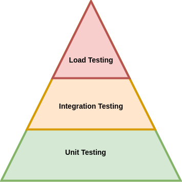

# url-shortener

Desafío Técnico: Acortador de URLs
Este proyecto es un servicio backend desarrollado con Spring Boot que permite acortar URLs largas en códigos únicos más cortos, facilitando su compartición y redirección. Además, ofrece operaciones para actualizar y redirigir enlaces, junto con cacheo en memoria (Caffeine) para mejorar el rendimiento.
Incluye pruebas unitarias e integración, carga el entorno fácilmente con Docker y permite futuras extensiones como monitoreo, análisis estadístico y escalado con Redis o Kafka.
El objetivo es demostrar buenas prácticas de desarrollo backend: código limpio, pruebas automatizadas, principios SOLID, separación de responsabilidades y configuración externa.

[[_TOC_]]

---

## Endpoints y Responsabilidad

El endpoint `PUT /v1/shorten/{shortCode}` permite actualizar tanto la URL original como su estado de actividad (`isActive`).  
En una arquitectura más granular, esto podría dividirse en endpoints independientes, respetando el principio de responsabilidad única (SRP).

##  Endpoints del servicio de acortamiento de URLs

| Método | Endpoint               | Descripción                                                                 |
|--------|------------------------|------------------------------------------------------------------------------|
| POST   | `/shorten`            | Crea una nueva URL corta a partir de una URL larga. Retorna la URL generada.|
| GET    | `/{shortCode}`        | Redirige a la URL original si el código corto es válido y está activo.      |
| PUT    | `/shorten/{shortCode}`| Actualiza la URL larga o el estado activo/inactivo de un código existente.  |


---

## Inyección de Dependencias

Se utilizó inyección de dependencias mediante constructor explícito, evitando el uso de `@Autowired`, lo que favorece la claridad, la inmutabilidad y una mejor compatibilidad con pruebas unitarias.

---

## Estrategia de Caché (Caffeine)

Para mejorar el rendimiento y reducir la carga sobre la base de datos, se implementa una caché en memoria utilizando **Caffeine**, ideal para almacenamiento local.

> Se decidió almacenar el objeto completo `ShortUrl` en caché. Esto permite acceder a propiedades como `accessCount`, `createdAt` o `isActive` sin hacer una nueva consulta a la base.  
Dado que el objeto es liviano, no representa una carga significativa de memoria.

> En un entorno distribuido, lo ideal sería usar **Redis** como caché centralizada. Sin embargo, se optó por Caffeine por simplicidad y menor costo de operación.

### Propiedades configurables (`app.cache.short-url`)

| Propiedad             | Descripción                                                                | Valor por defecto |
|-----------------------|----------------------------------------------------------------------------|-------------------|
| `expire-after-write`  | Tiempo desde la última escritura tras el cual una entrada expira           | `10m`             |
| `expire-after-access` | *(Opcional)* Tiempo desde el último acceso tras el cual una entrada expira | — *(no definido)* |
| `refresh-after-write` | *(Opcional)* Tiempo tras el cual una entrada se actualiza en segundo plano | — *(no definido)* |
| `maximum-size`        | Número máximo de entradas antes de aplicar política de expulsión           | `10000`           |
| `initial-capacity`    | Tamaño inicial de la caché para evitar redimensionamiento                  | `100`             |
| `record-stats`        | Habilita la recolección de estadísticas de uso                             | `false`           |

#### Ejemplo de configuración (`application.yml`)

```yaml
app:
  cache:
    short-url:
      expire-after-write: 10m
      expire-after-access: 5m
      refresh-after-write: 15m
      maximum-size: 10000
      initial-capacity: 100
      record-stats: false
```

---

---

## Base de Datos

Este proyecto utiliza **PostgreSQL** como base de datos.  
Se añadieron **índices** en las columnas clave para optimizar la búsqueda de URLs y mejorar el rendimiento de redirección y actualización.

> Para escalar la solución y mantener un orden en los cambios de esquema, se recomienda integrar una herramienta gestora de base de datos, como **Liquibase** o similares.  
> Estas herramientas permiten llevar control de versiones en la base de datos, facilitando el despliegue automatizado y consistente de cambios estructurales a lo largo del ciclo de vida del proyecto.

---

## Tests

Se procuró seguir un **enfoque piramidal de testing**, priorizando una mayor cantidad de pruebas unitarias sobre las pruebas de integración y carga.  
Esto permite detectar errores más rápido, con menor costo computacional, y facilita el mantenimiento del código.



### Pruebas unitarias

Se implementaron pruebas unitarias centradas en la lógica de negocio y clases individuales del sistema.  
Estas pruebas son rápidas de ejecutar, ayudan a prevenir regresiones y constituyen la base de la pirámide de pruebas.  
Al no depender de otras capas como la base de datos o el framework web, su mantenimiento es más simple y su ejecución más eficiente.

### Pruebas de integración

Se utilizaron pruebas de integración para validar la interacción entre componentes clave del sistema, como controladores y servicios.  
Se empleó [`MockMvcTester`](https://blog.jetbrains.com/idea/2025/04/a-practical-guide-to-testing-spring-controllers-with-mockmvctester/?lidx=0&wpid=557045) para evaluar de forma fluida la capa de presentación y garantizar un comportamiento coherente frente a distintas solicitudes HTTP.

### Pruebas de carga

Se utilizó **k6** para realizar pruebas de carga al endpoint de acortamiento (`POST /shorten`) con 100K muestras.  
Aunque estas pruebas no garantizan la inexistencia de colisiones, permiten evaluar la distribución y estabilidad del sistema bajo carga.

> En producción se recomienda un mecanismo de detección y control de colisiones a nivel de base de datos por seguridad.

## Cómo levantar el proyecto

Asegúrate de tener Docker y Docker Compose instalados.

### 1. Construir y levantar los contenedores

```bash
docker compose up --build -d
```

Esto levantará:

- La base de datos PostgreSQL (en el puerto `5433`)
- El backend del acortador de URLs (`urlshortener`) en el puerto `8080` con el perfil `postgres`

### 2. Ver logs en tiempo real

```bash
docker compose logs -f
```

### 3. Apagar los servicios

```bash
docker compose down
```

### 4. Ejecutar test de carga con k6

Asegúrate de que el servicio esté arriba antes de ejecutar:

```bash
k6 run load-tests/shorten-test.js
```


##  Cobertura de Tests (JaCoCo)

Este proyecto utiliza [JaCoCo](https://www.jacoco.org/jacoco/) para generar reportes de cobertura de código.

### Ejecutar y ver el reporte

```bash
mvn clean verify
```

>  **Nota**: Por simplicidad, este proyecto no utiliza [Testcontainers](https://www.testcontainers.org/) actualmente.
> Sin embargo, podría integrarse en el futuro para ejecutar pruebas de integración contra bases de datos reales
> (como PostgreSQL) sin necesidad de levantar contenedores externos manualmente.
