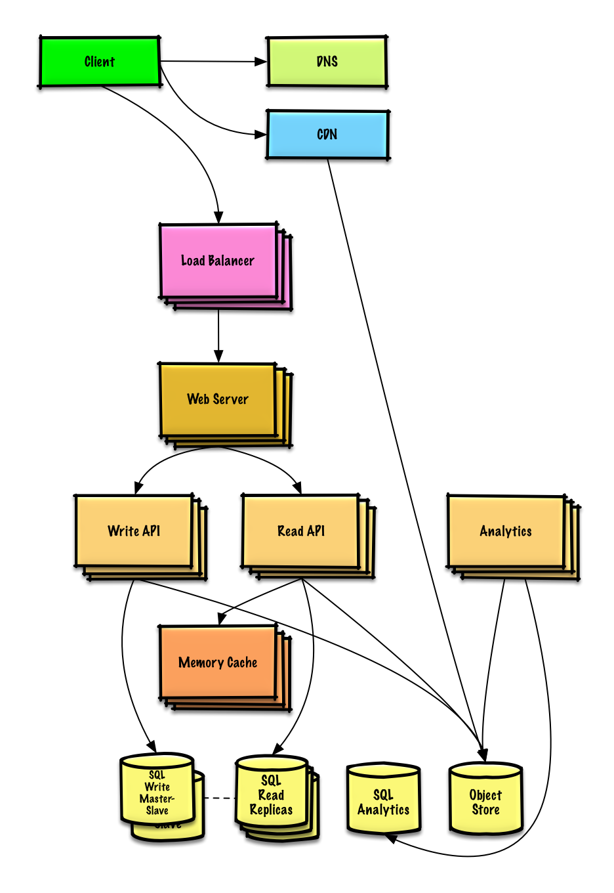

# Arquitectura del Proyecto: URL Shortener

---

> Este documento describe los componentes clave del sistema, decisiones tecnológicas, patrones aplicados y fundamentos arquitectónicos del acortador de URLs, desarrollado como parte de un desafío técnico.

## Objetivos Arquitectónicos

* Alta disponibilidad y rendimiento.
* Escalabilidad horizontal.
* Bajo costo de operación inicial.
* Trazabilidad y mantenibilidad.
* Extensibilidad futura sin romper el diseño actual.

## Alta disponibilidad y balanceo de carga

Para aproximarse a un **uptime del 99.98%**, se requiere una arquitectura resiliente y tolerante a fallos.  
En esta prueba técnica, se implementó un balanceador de carga básico con **NGINX** y múltiples instancias de la aplicación, todo definido en el archivo `docker-compose.nginx.yml`.

```nginx
upstream urlshortener_backend {
    server urlshortener-1:8080;
    server urlshortener-2:8080;
}

server {
    listen 80;

    location / {
        proxy_pass http://urlshortener_backend;
        proxy_set_header Host $host;
        proxy_set_header X-Real-IP $remote_addr;
        proxy_set_header X-Target-Port $server_port;

        add_header X-Upstream-Address $upstream_addr;
    }
}
```

## Recomendaciones para entornos productivos

Para lograr un sistema verdaderamente robusto y disponible, se recomienda:

### Tolerancia a fallos
- Replicación de base de datos y *failover* automático.
- Uso de **Resilience4j** para:
    - Circuit Breakers
    - Retries automáticos
    - Rate Limiting
    - Bulkheads

### Observabilidad
- Integración con **Prometheus** o **OpenTelemetry** para métricas, logs y trazas distribuidas.

---

> Estas recomendaciones no fueron implementadas en esta prueba técnica, pero son fundamentales para alcanzar los niveles de disponibilidad, rendimiento y resiliencia esperados en entornos de producción reales.


## Componentes del Sistema

| Tecnología     | Rol en el sistema                                                                         |
|----------------|-------------------------------------------------------------------------------------------|
| Spring Boot    | Expone la API REST para acortar, redirigir y actualizar URLs.                             |
| PostgreSQL     | Base de datos relacional para almacenamiento persistente de URLs y metadatos.             |
| Caffeine	      | Caché embebida en memoria, usada para redirección rápida y evitar hits innecesarios a BD. |
| Docker Compose | Orquesta la base de datos y backend para despliegue local o demostraciones.               |
| k6             | Herramienta de pruebas de carga para validar desempeño bajo 5000 RPM sostenidas.          |

>
> En un entorno productivo, se recomienda el reemplazo de Caffeine por Redis y la introducción de herramientas como
> Kafka, Prometheus y Kubernetes.

## Estrategia de Generación de Códigos

   ``` java
   public class Base62ShortCodeGenerator implements ShortCodeGenerator
   ``` 

* Algoritmo actual: Base62 aleatorio (a-zA-Z0-9).
* Fuente de aleatoriedad: SecureRandom para evitar colisiones.
* Longitud configurable (por defecto: 6 caracteres).
* Se utiliza una interfaz (ShortCodeGenerator) para permitir nuevas estrategias como:
  * Hash de URL + timestamp
  * Códigos incrementales o distribuidos
  * Generadores basados en base de datos o UUID codificado

>Este enfoque sigue el principio de Open/Closed (OCP): el sistema está abierto a extensión sin modificar código
existente.

## Patrones de Diseño Aplicados
   | Patrón                   | 	Aplicación en el sistema                                                                |
   |--------------------------|------------------------------------------------------------------------------------------|
   | Cache-Aside              | 	Se consulta primero la caché (Caffeine), luego la base de datos si hay fallo de caché.  |
   | Strategy Pattern         | 	Implementado mediante ShortCodeGenerator para desacoplar la lógica de generación.       |
   | Command-Query Separation | 	Las operaciones de escritura y lectura están claramente separadas.                      |

## Justificación Tecnológica

| Tecnología	 | Justificación                                                                    |
|-------------|----------------------------------------------------------------------------------|
| Spring Boot | 	Rápido desarrollo, soporte de comunidad, ideal para APIs RESTful.               |
| PostgreSQL  | 	ACID, familiaridad generalizada, buen rendimiento en lecturas/escrituras.       |
| Caffeine    | 	Cache local muy rápida y liviana, ideal para PoC o sistemas monolíticos.        |
| Docker      | 	Facilita el despliegue, pruebas locales y portabilidad.                         |
| k6          | 	Permite medir rendimiento en RPM y latencias, ideal para pruebas automatizadas. |

## Tecnologías consideradas pero no implementadas

Durante el desarrollo se priorizó el uso de tecnologías conocidas y de rápido desarrollo. Sin embargo, se consideraron otras alternativas que podrían explorarse en versiones maduras del sistema:

- **Micronaut**: framework más liviano y rápido que Spring Boot, ideal para microservicios con alta demanda de rendimiento y tiempos de arranque mínimos. No se utilizó por razones de familiaridad y tiempo acotado.
  - Adjunto una interesante [charla](https://www.youtube.com/watch?v=MPZ9loEniRY) sobre el framework por parte de uno de los commiters en habla hispana 
- **Redis**: como caché distribuida, útil en entornos con múltiples instancias del backend.
- **Kafka / RabbitMQ**: para procesamiento asincrónico de eventos (como estadísticas de clics).
- **Kubernetes**: para orquestación y despliegue en producción a gran escala.




## Escalamiento Futuro
Aunque la aplicación actual fue diseñada como un microservicio monolítico y probado bajo ~5000 RPM, su arquitectura limpia permite evolucionar hacia una solución distribuida capaz de manejar millones de solicitudes por minuto. A continuación, se detallan las decisiones y estrategias para escalar el sistema:

### Separación de responsabilidades en microservicios
Dividir el sistema en componentes independientes permite escalar de forma granular:
- ShortenerService:	Generar códigos y almacenar URLs.
- RedirectService:	Resolver códigos y redirigir al destino.
- StatsService:	Registrar accesos y generar estadísticas (idealmente asíncrono).
### Caché distribuida
Reemplazar Caffeine por Redis o Memcached para:
- Compartir caché entre instancias.
- Reducir presión sobre la base de datos.
- Acelerar tiempos de redirección (~milisegundos).

### Procesamiento asíncrono
Incorporar Kafka o RabbitMQ para registrar accesos sin bloquear el flujo principal:
- Los eventos de acceso se publican en una cola.
- Un consumidor los persiste o agrupa para análisis en batch.

### Escalado horizontal
- Desplegar múltiples instancias tras un balanceador de carga. 
- Orquestar con Kubernetes (autodescubrimiento, escalado automático, tolerancia a fallos).

### Persistencia escalable
- PostgreSQL con replicación master-slave.
- Uso de réplicas de lectura.
- Sharding si se alcanza un volumen elevado.
- Alternativamente, evaluar NoSQL como DynamoDB o Cassandra si se privilegia latencia sobre consistencia fuerte.

### Almacenamiento externo
En caso de almacenar blobs o grandes cantidades de datos, utilizar un Object Store (ej. Amazon S3).

### Alta disponibilidad
- Despliegues multi-zona.
- Mecanismos de failover para Redis y PostgreSQL.
- Uso de health checks y circuit breakers con Resilience4j.

### Observabilidad
- Logs centralizados con ELK o Loki.
- Trazas distribuidas con OpenTelemetry.
- Métricas con Prometheus + Grafana o herramientas cloud.

Estas decisiones permitirán evolucionar el sistema desde un entorno monolítico y local hacia una solución distribuida, robusta y preparada para una demanda de nivel empresarial.

- [System Design Primer: Escalado progresivo](https://github.com/donnemartin/system-design-primer/blob/master/solutions/system_design/pastebin/README.md#step-4-scale-the-design)