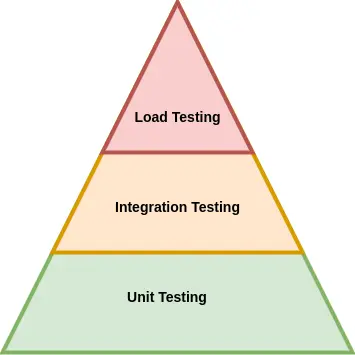

# Testing y Cobertura

Este proyecto sigue un enfoque de **pirámide de testing**, donde se prioriza una mayor cantidad de pruebas unitarias
sobre pruebas de integración y carga.  
Esto mejora la velocidad de desarrollo, reduce el costo de mantenimiento y permite detectar errores rápidamente.

---

## Enfoque piramidal



* Pruebas unitarias: validan la lógica de negocio en componentes individuales sin dependencias externas.
* Pruebas de integración: validan la interacción entre capas (por ejemplo, controladores ↔ servicios).
* Pruebas de carga: evalúan el comportamiento bajo condiciones de estrés o alto tráfico.

## Pruebas unitarias

* Se usa JUnit 5 para probar clases del dominio y servicios.
* Se aplican mocks para evitar dependencias externas.
* Cada prueba cubre un caso de uso específico para asegurar el correcto funcionamiento del sistema.

## Pruebas de integración

* Se usa [MockMvcTester](https://blog.jetbrains.com/idea/2025/04/a-practical-guide-to-testing-spring-controllers-with-mockmvctester/?lidx=0&wpid=557045) para verificar endpoints.
* Las pruebas validan redirecciones, creación y edición de URLs.
* Se evita el uso de una base de datos real. **Se podría usar Testcontainers en un entorno más completo.**

## Pruebas de carga (k6)

Se utilizó [k6](https://k6.io/) para simular carga sobre el endpoint `POST /shorten`.

- Simulación de **~5000 RPM** (`84 RPS`) durante **1 minuto**.
- **5040 requests completadas** exitosamente sin errores (`100% success`).
- **Latencia promedio**: ~3ms.
- El test se ejecutó localmente con `constant_request_rate` y hasta **100 VUs preasignados**.

> La prueba demostró que el sistema es capaz de sostener una carga moderada de forma estable, lo cual cumple con los objetivos planteados para esta PoC.

## Cobertura (JaCoCo)

Este proyecto utiliza [JaCoCo](https://www.jacoco.org/jacoco/) para generar reportes de cobertura.

### Ejecutar y generar el reporte:

```bash
mvn clean verify
```

El reporte se genera en:

```bash
target/site/jacoco/index.html
```